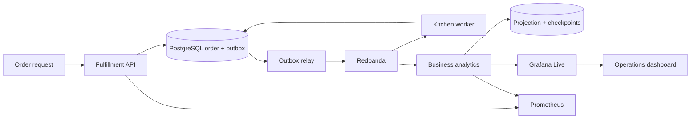

# LogistPulse Fulfillment — Observable order fulfillment

LogistPulse Fulfillment is an event-driven application for tracking orders and detecting preparation delays. It follows an accepted order through preparation, durable event delivery, recoverable analytics and a live Grafana dashboard, then proves that the release process catches an order stuck before `READY` even while the platform remains technically healthy.

The application connects order processing, kitchen work and business observability in one reproducible system. The broader [LogistPulse platform](https://github.com/VillaforTech/logistpulse) also covers inventory, distribution and equipment operations through its own contribution workflow.

> Stores, orders and amounts are synthetic. Values are demo monetary units and do not represent real revenue or transactions.

## Product capabilities

- Valid `WAITING → PREPARING → READY` transitions with persistent timestamps and revisions.
- Transactional order and outbox writes plus stable, retryable event publication.
- Separate kitchen commands and analytics facts on Kafka-compatible Redpanda.
- An owned analytics projection with inbox deduplication and checkpoints.
- Live overdue-order rate, value at risk and accumulated preparation debt.
- Native Grafana Live rendering with identity, revision, freshness and reconnect behavior.
- Recovery after broker interruption, consumer restart and duplicate delivery.
- A required release gate that distinguishes platform health from business correctness.

## Data flow



The event stream describes committed business state. Analytics owns its projection and does not read fulfillment tables. Timers discover an overdue order even when no new event arrives.

## Run the product

Requirements: Docker Compose v2, Python 3.12 and Node 22 for browser verification. `scripts/configure.py` creates local configuration without publishing credentials.

```bash
python3 scripts/configure.py
bash scripts/up.sh
bash scripts/smoke.sh
```

| Surface | Local URL |
| --- | --- |
| Operations console | <http://localhost:28080> |
| Live fulfillment dashboard | <http://localhost:28080/grafana/d/logistpulse-business/logistpulse-business> |
| Direct Grafana | <http://localhost:23000/grafana/> |
| Prometheus | <http://localhost:29090> |
| cAdvisor, optional | <http://localhost:28088> |

In Codespaces, open port `28080`; configuration detects its forwarded URL for the Grafana proxy. The Compose wrapper isolates networks and volumes from other checkouts.

Create and inspect an order:

```bash
curl -fsS http://localhost:28080/api/fulfillment/orders \
  -H 'Content-Type: application/json' \
  -H 'X-Correlation-ID: portfolio-demo-01' \
  -d '{"storeId":"STORE-042","channel":"DEMO","total":"25.50","fixtureRunId":"portfolio-demo-01"}'

curl -fsS http://localhost:28080/api/fulfillment/orders/RETURNED_ORDER_ID
curl -fsS http://localhost:28080/api/business/snapshot
```

After testing, stop the stack without deleting its evidence volumes:

```bash
bash scripts/down.sh
```

## Validate the full system

```bash
python3 -m venv .venv
.venv/bin/pip install -r requirements-dev.txt
.venv/bin/pytest tests/unit -q
node --test tests/browser/*.test.mjs
mkdir -p artifacts
bash scripts/compose.sh run --rm --build database-tests
.venv/bin/python scripts/business_test.py
npm ci
npx playwright install --with-deps chromium
npm run browser-test
.venv/bin/python scripts/resilience_test.py
.venv/bin/python scripts/verify_evidence.py
bash scripts/capture.sh
```

The browser benchmark creates 100 sequential orders and measures from API invocation until all three Grafana cards show the same identity, revision, freshness and expected values for two animation frames. The four-second kitchen preparation time is excluded from render latency. Missing updates count as failures; they are never removed from the percentile.

The final branch passed:

- all required GitHub checks and `Release gate`;
- 100/100 correlated Grafana renders with no loss or browser errors;
- 35 unit and 54 database-backed tests plus business and recovery checks;
- a clean local devcontainer reproduction;
- a fresh 4-core Codespace reproduction with p95 594.2 ms.

See the [versioned Codespaces evidence](docs/evidence/codespaces-20260915/README.md), [business event contract](docs/business-events.md), [KPI definitions](docs/business-kpis.md), [architecture decisions](docs/adr/README.md) and [observability guide](observability/README.md).

## Failure story

The project preserves a deliberately broken revision where eight services report healthy while an accepted order remains `PREPARING` after its deadline. Timers raise the business indicators, the oracle fails and the required gate blocks the pull request at that exact SHA. The corrected revision restores `READY` and passes the same pipeline.

## Engineering workstreams

| Workstream | Implementation |
| --- | --- |
| Domain and events | `services/logist/{domain,fulfillment,storage,relay,worker}.py` |
| Analytics | `services/logist/analytics.py`, projection and database tests |
| Live experience | Grafana plugin, dashboard and browser harness |
| Platform integration | Isolated Compose stack, readiness and required CI gate |
| Verification | Business, resilience, browser and evidence scripts |

Implementation: Roberto Villafuerte, with Codex assistance. The repository preserves its original history; contributor credit follows the commits, reviews and merged pull requests in each project.

## Verification evidence

See [business verification and recovery](docs/business-verification.md) for failure scenarios, diagnosis, release controls and reproducible results.
