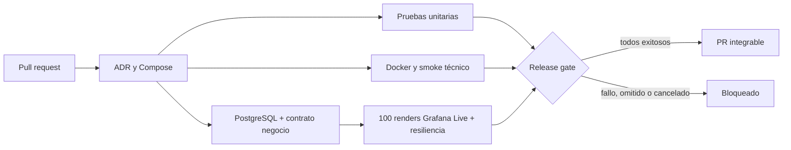

# Deber 01 — El Falso Verde: referencia LogistPulse

## 1. Capability crítica

Cumplir la promesa de preparación: cada pedido aceptado alcanza READY dentro de 15 segundos. El usuario necesita el pedido terminado, no solo una respuesta HTTP exitosa.

## 2. Falso verde posible

El smoke técnico comprueba consola, inventario, distribución, telemetría, creación ORD- y health UP. Si se omite la transición final del worker, todos pueden responder correctamente mientras el pedido queda PREPARING. El punto controlado para demostrarlo es `services/logist/worker.py:finish_preparation`; no hay que apagar Kafka ni romper el arranque.

## 3. Riesgo para negocio

Una orden aceptada queda sin entregar. Aumentan la proporción de promesas incumplidas, el valor de pedidos vencidos y los segundos de deuda de preparación. Son [L-K1/L-K2/L-K3](kpis-deber-01.md), con muestra y unidad explícitas.

## 4. Flujo del bloqueo

El laboratorio de negocio es independiente del resultado unitario; guarda evidencia de una regresión antes de detener los servicios.

## 5. PR sano

La implementación vive en [PR #1](https://github.com/VillaforTech/LOGISTPULSE-GOLDEN_2-REFERENCE/pull/1), rama `codex/reference-implementation` de este gemelo. El [run sano inicial 34886316963](https://github.com/VillaforTech/LOGISTPULSE-GOLDEN_2-REFERENCE/actions/runs/34886316963) pasó todos los jobs y Release gate sobre d283f62. La [selección de evidencia local](evidence/README.md) conserva 100/100 renders, p95 619.1 ms, detección de vencimiento y recuperación sin reload. Un draft o una ejecución posterior en curso no se describe como aprobada.

## 6. PR técnicamente sano con negocio roto

Crear una rama de demostración desde la implementación validada, sustituir solo el resultado de `finish_preparation` por `(order, False)` y abrir PR al gemelo. Conservar todas las pruebas. La suite unitaria debe detectar la transición ausente; además el laboratorio independiente debe observar health UP y, transcurridos 19 segundos, PREPARING, L-K1=100%, L-K2=25.50 DEMO y deuda positiva. Es una regresión controlada, no una solución que deba integrarse.

## 7. Evidencia de bloqueo

CI sube `unit-evidence`, `technical-evidence` y `business-and-streaming-evidence` antes del teardown. `business/evidence.json` contiene fixtureRunId, pedido exacto, timestamps, health y snapshots aun cuando falla la promesa. `Release gate` exige todos los jobs y bloquea omitted/cancelled/failed. El índice final enlazará el PR, run y comprobación real de protección; este texto por sí solo no los acredita.

## 8. Diagnóstico y corrección

Baseline `d35fded`: el run 34871225487 falló con 502 de inventario y conexión rechazada. Eso evidencia una dependencia no disponible al consultar; no demuestra por sí solo que `executemany` causó el 502. Por inspección había además un `Connection.executemany` incorrecto en dos bootstraps. La referencia usa cursores, propaga errores de programación, consulta tablas en health y espera readiness antes del proxy. El primer run de esta implementación también reveló Decimal×float en el cálculo de inventario y pérdida de precisión en timestamps float→numeric. Se corrigieron con aritmética Decimal y timestamps canónicos de microsegundos; se conservaron el smoke y las validaciones temporales.

Para el fallo de negocio, la corrección conserva READY y readyAt en la transacción del worker junto con el hecho de outbox. Repetir un comando no reabre ni retima un pedido ya terminado. Las pruebas comprueban estado y tiempo, separadas de la salud técnica.

## 9. Ejecución final y reproducción

Seguir el README desde clon limpio/Codespaces: generar `.env`, arrancar, smoke, unit, PostgreSQL, contrato, 100 renders y resiliencia. Guardar commit, recursos y artifacts. El coordinador añadirá los enlaces de las ejecuciones observadas y la comprobación independiente cuando terminen. No se afirma todavía reproducción por otra persona, merge, aprobación ni entrega D2L.

La referencia implementa ambos contratos de infraestructura y negocio; la adaptación al repositorio compartido sigue su propio flujo de PR y revisión. El gemelo no cambia los permisos del original.
