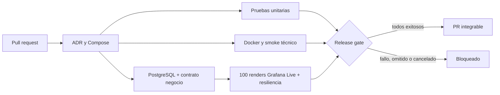

# Deber 01 — El Falso Verde: referencia LogistPulse

## 1. Capability crítica

Cumplir la promesa de preparación: cada pedido aceptado alcanza READY dentro de 15 segundos. El usuario necesita el pedido terminado, no solo una respuesta HTTP exitosa.

## 2. Falso verde posible

El smoke técnico comprueba consola, inventario, distribución, telemetría, creación ORD- y health UP. Si se omite la transición final del worker, todos pueden responder correctamente mientras el pedido queda PREPARING. El punto controlado para demostrarlo es `services/logist/worker.py:finish_preparation`; no hay que apagar Kafka ni romper el arranque.

## 3. Riesgo para negocio

Una orden aceptada queda sin entregar. Aumentan la proporción de promesas incumplidas, el valor de pedidos vencidos y los segundos de deuda de preparación. Son [L-K1/L-K2/L-K3](kpis-deber-01.md), con muestra y unidad explícitas.

## 4. Flujo del bloqueo

El laboratorio de negocio es independiente del resultado unitario; guarda evidencia de una regresión antes de detener los servicios.

## 5. PR sano

El run sano actualizado [35015790965](https://github.com/VillaforTech/logistpulse-reference/actions/runs/35015790965), SHA `67de54d`, pasó unidades, PostgreSQL, negocio, streaming, resiliencia y gate: 100/100 renders, cero pérdidas, p95 600.4 ms y máximo 661.7 ms. [Evidencia conservada](evidence/ci-green-35015790965/README.md). La implementación vive en [PR #1](https://github.com/VillaforTech/logistpulse-reference/pull/1), rama `codex/reference-implementation` de este gemelo. El [run sano inicial 34886316963](https://github.com/VillaforTech/logistpulse-reference/actions/runs/34886316963) pasó todos los jobs y Release gate sobre d283f62. La [selección de evidencia local](evidence/README.md) conserva 100/100 renders, p95 619.1 ms, detección de vencimiento y recuperación sin reload. Un draft o una ejecución posterior en curso no se describe como aprobada.

## 6. PR técnicamente sano con negocio roto

La regresión se ejecutó en [PR #2](https://github.com/VillaforTech/logistpulse-reference/pull/2), commit `666533d`: solo se omitió READY en `finish_preparation`. [Run rojo 35016950178](https://github.com/VillaforTech/logistpulse-reference/actions/runs/35016950178) pasó arquitectura y smoke técnico, pero falló unidades y la prueba independiente de negocio. El pedido seguía PREPARING a los 19.07 s, sin readyAt, con los ocho servicios UP y analítica FRESH: L-K1=100%, L-K2=25.50 DEMO y L-K3 positivo.

[Captura y datos del fallo](evidence/demo-red-35016950178/README.md). El panel muestra el mismo pedido/fixture: 100%, 25.5 y 9.97 pedido-segundos en una captura posterior; el JSON de negocio observó 3.99492 s antes. No se mezclan sus timestamps.

## 7. Evidencia de bloqueo

La captura contemporánea de GitHub conserva el PR #2 listo, OPEN, MERGEABLE y **BLOCKED** en el mismo SHA rojo, con `Release gate` requerido y enforcement de administradores. [Estado observado](evidence/demo-red-35016950178/github-summary.json). No se infiere bloqueo a partir de un draft ni de un SHA distinto. CI conservó datos, health, captura, JUnit y decisión del gate antes del teardown.

## 8. Diagnóstico y corrección

Baseline `d35fded`: el run 34871225487 falló con 502 de inventario y conexión rechazada. Eso evidencia una dependencia no disponible al consultar; no demuestra por sí solo que `executemany` causó el 502. Por inspección había además un `Connection.executemany` incorrecto en dos bootstraps. La referencia usa cursores, propaga errores de programación, consulta tablas en health y espera readiness antes del proxy. El primer run de esta implementación también reveló Decimal×float en el cálculo de inventario y pérdida de precisión en timestamps float→numeric. Se corrigieron con aritmética Decimal y timestamps canónicos de microsegundos; se conservaron el smoke y las validaciones temporales.

Para el fallo de negocio, la corrección conserva READY y readyAt en la transacción del worker junto con el hecho de outbox. Repetir un comando no reabre ni retima un pedido ya terminado. Las pruebas comprueban estado y tiempo, separadas de la salud técnica.

## 9. Ejecución final y reproducción

Seguir el README desde clon limpio/Codespaces: generar `.env`, arrancar, smoke, unit, PostgreSQL, contrato, 100 renders y resiliencia. Guardar commit, recursos y artifacts. El PR #2 restaura exactamente la transición READY y sus tests; su sección Checks y descripción enlazan el nuevo run de corrección una vez concluido. La evidencia histórica anterior conserva sus SHAs originales. La [reproducción completa en Codespaces limpio](evidence/codespaces-20260915/README.md) pasó el 15 de septiembre en `ba93646a30ad`: unitarias, PostgreSQL, negocio, 100/100 renders con p95 594.2 ms y recuperación. La consola privada también mostró snapshots FRESH correlacionados. Se guardó evidencia y se retiró el entorno temporal. No se afirma reproducción por otra persona, merge, aprobación ni entrega D2L.

La referencia implementa ambos contratos de infraestructura y negocio; la adaptación al repositorio compartido sigue su propio flujo de PR y revisión. El gemelo no cambia los permisos del original.

## Uso por el equipo

Consultar el [PR de infraestructura compartida #10](https://github.com/VillaforTech/logistpulse/pull/10) y `docs/TEAM-INTEGRATION.md` en esa rama. La analítica del equipo conserva SQLite y sus propios endpoints; el gemelo es una implementación completa de referencia con PostgreSQL. Adaptar por contrato, sin sustituir la contribución ni atribuir su autoría al compañero.
